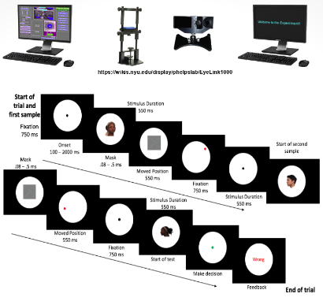

# Arbitrarily Learned Sensorimotor Association (ALSA) Project
Toolboxes: Psychophysics/Eyelink

Chinasa T. Okolo
Summer 2016
Columbia University
Neuroscience Department

Collaborators: Dr. Michael Shadlen (Columbia University), Dr. Danique Jeurissen (Columbia University)

## Abstract
Years of meticulous work have led to a comprehensive understanding of the process of decision making, which can be described by the brain gathering and evaluating pieces of information to determine whether there is sufficient evidence to make a choice. This process is also accompanied by specific levels of confidence which aid in the speed and accuracy of the decision made. The experiment I designed and crafted is an associative memory task involving recall of image position. It tests accuracy, precision, reaction time, and speed of saccades (quick, simultaneous movement of both eyes between two or more phases of fixation in the same direction). One of the main goals of this experiment is to identify methods subjects use and the variables that influence how subjects remember the final position of the images. 

The analytical framework designed in this project was implemented using the Psychophysics and Eyelink Toolbox in MATLAB and an Eyelink Gazetracker was used to collect visual data. This will simplify future iterations of this experiment while also providing tools other researchers can readily adapt to experimentation with non-human primates. This project aims to provide preliminary research that will establish the basis for a new visual tasks, using MATLAB and eye tracking software to address context-specific questions, further gaining insight into the process of recognition memory in the way perceptual decision making is studied.

## Research Question
What is the effect of time and quantity on the ability of subjects to make decisions on visual stimuli?  ma (LIP – makes decisions and FP – encode faces). How does memory encoding and retrieval work and how can we tap into a process like this? 

## Methods
In this associative memory task, the experiment is simulated by a sample-sample-test paradigm in which two different samples are shown before testing one of the previously shown samples. In this task, the samples are represented by images that are taken from a face database created by the Tarrlab at Brown University. The faces are diverse and include subjects of African-American, Asian, Hispanic, and white backgrounds. The analytical framework designed in this project was implemented using the Psychophysics and Eyelink Toolbox in MATLAB and an Eyelink Gazetracker was used to collect visual data. Subjects were trained to perform this task in which they learned the moved position of two different images in order to recall its moved position. Since this task was tested by human primates, training consisted of one sample trial that gave the subject insight as to how the task should be performed. 

## Project Presentation
A video of the project presentation can be found [here](https://www.youtube.com/watch?v=XP98nyfkWB0).

## Acknowledgements
This research was made possible by the [HHMI-funded Exceptional Research Opportunities Program](https://www.hhmi.org/node/18676/devel) (EXROP) and the [SPURS Biomedical Research Program](https://www.spurs.columbia.edu/index.html) at Columbia University.
